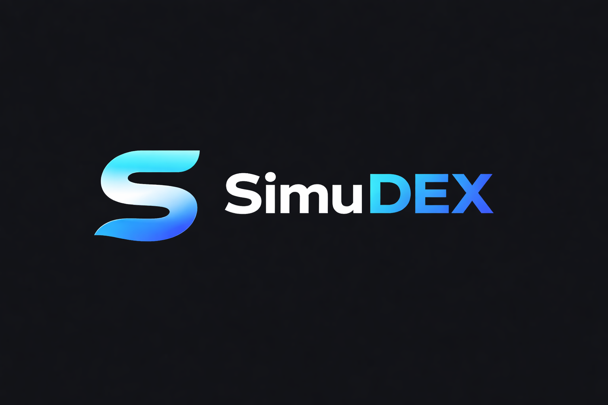

# <p align="center">⚡ SimuDEX</p>

<p align="center">
  
</p>

<p align="center">
  <a href="https://opensource.org/licenses/MIT"></a>
  <a href="https://nextjs.org/"></a>
  <a href="https://www.typescriptlang.org/"></a>
  <a href="https://supabase.com/"></a>
  <a href="https://vercel.com"></a>
</p>

---

**SimuDEX** is a high-fidelity cryptocurrency trading simulator that lets you experience the high-octane world of decentralized finance (DeFi) without any real financial risk. Built for developers, traders, and learners.

[**Live Demo**](https://simudex.vercel.app) | [**Documentation**](website/src/app/docs/page.tsx) | [**Changelog**](CHANGELOG.md)

---

## ✨ Features

- **🛡️ Risk-Free Trading:** Start with **10,000 simulated USDT** and trade real-time user-generated tokens.
- **🦄 AMM Trading Engine:** Fully functional swap interface powered by the `x * y = k` constant product formula.
- **🔐 Secure Auth:** Integrated **GitHub OAuth** for seamless account management.
- **📈 Live Analytics:** Real-time price charts, portfolio allocation, and market treemaps.
- **💀 SimuDEX Mode:** A high-stakes "Game of Chicken" where you must sell before the liquidity is pulled.
- **📊 Global Leaderboard:** Compete with other traders to become the richest simulated whale.
- **🚀 Token Launchpad:** Create your own simulated tokens with custom supply and initial liquidity.

## 🛠️ Technical Architecture

SimuDEX is built using a modern, scalable stack designed for performance and developer experience.

- **Framework:** [Next.js 14](https://nextjs.org/) (App Router)
- **Styling:** [Tailwind CSS 4.0](https://tailwindcss.com/) with Glassmorphism.
- **UI Components:** [Shadcn UI](https://ui.shadcn.com/) (Radix Primitives).
- **Database:** [PostgreSQL](https://www.postgresql.org/) hosted on [Supabase](https://supabase.com/).
- **ORM:** [Prisma](https://www.prisma.io/) for type-safe database queries.
- **Charts:** [Recharts](https://recharts.org/) for data visualization.

## 🚀 Getting Started

### 1. Clone & Install
```bash
git clone https://github.com/sploov/SimuDEX.git
cd SimuDEX/website
npm install
```

### 2. Configure Environment
Create a `.env` file in the `website/` directory:
```env
DATABASE_URL="your_supabase_pooler_url"
DIRECT_URL="your_supabase_direct_url"
GITHUB_ID="your_github_client_id"
GITHUB_SECRET="your_github_client_secret"
AUTH_SECRET="random_secret_string"
```

### 3. Sync & Run
```bash
npx prisma db push
npm run dev
```

## 🗺️ Roadmap

- [x] v1.0 Launch (Trading, Auth, Portfolio)
- [ ] Wallet Connection (Simulated Web3)
- [ ] Referral System
- [ ] Advanced Limit Orders
- [ ] Mobile App (Capacitor/PWA)

## 🤝 Contributing

We love contributions! SimuDEX is open-source and we welcome features, bug fixes, and documentation improvements.

1. Fork the Project
2. Create your Feature Branch (`git checkout -b feature/AmazingFeature`)
3. Commit your Changes (`git commit -m 'Add some AmazingFeature'`).
4. Push to the Branch (`git push origin feature/AmazingFeature`)
5. Open a Pull Request

## 📜 License

Distributed under the MIT License. See `LICENSE` for more information.

---

<p align="center">
  <b>Built with ❤️ by <a href="https://github.com/sploov">Sploov</a> & <a href="https://github.com/ramkrishna-xyz">Ramkrishna</a></b>
</p>
